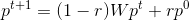

# Random Walk with Restart

## Theory
Originally designed for image segmentation, Random Walk with Restart (RWR) is an algorithm that gives the closeness between two nodes in a graph. Random walk is the iterative transitions of a walker from its current node to a randomly selected adjacent node. In RWR, at each state there is also the possibility to restart, with probability *r*, from the start node rather than continue the current walk. The RWR can be defined as:

Where *W* is the adjacency matrix of the graph, with *W[i][j]* being the probability of moving from node *j* to node *i*, and *p^t* is the vector in which the ith element is the probability of being at node *i* at step *t*. *p^0* is the initial probability vector, which will be generated by assigning all known nodes associated with the disease of interest an equal probability of being a start node, which sum to 1. All other nodes will be assigned a 0.

Candidate genes will be ranked according to their values in the steady-state probability vector, which is obtained by running the algorithm until the difference between two steps in the walk *p^t* and *p^t+1* is less than 10^-6.

## Implementation
### random_walk_matrix()
This function performs the random walk on a normalized adjacency matrix while the difference between two vectors is greater than the normalized threshold. After the difference is smaller than the threshold or the number of iterations exceeds the maximum number of iterations, the algorithm stops and the final vector is returned. The algorithm runs in two main steps. First, a new vector is computed by multiplying the start vector by *(1-r)*. Second, this new vector is added to the startVector * r. The *diff* variable is initialized as a floating point number equivalent to infinity so that the loop begins to run. The difference and number of iterations are updated each step of the algorithm.

### create_normalized_matrix()
This function uses a function from GraphUtils to transform the networkx graph into a normalized adjacency matrix.

### random_walk()
This is a wrapper function for random_walk_matrix() that is used in validation scripts. The normalized matrix will be computed if the normalized adjacency matrix has not already been computed and pickled. If the file has been pickled before, the normalized adjacency matrix is loaded from the pickled file. The function then runs random_walk_matrix with the given graph, *R*, and start vector and returns an output vector that is formatted using a function from GraphUtils.

### main()
The main method allows the wrapper method random_walk() to be run from the run.py in the command line. Command line arguments are parsed and passed to random_walk() and the output of random_walk() is written to a .csv file that is saved to the given file path.
